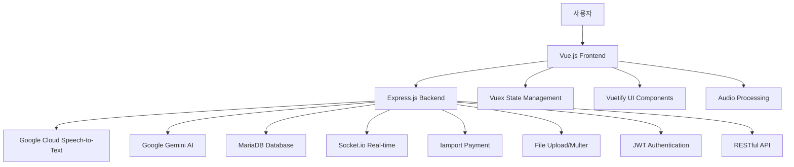

# 실타래 음성인식 키오스크 서비스

**음성인식 기술과 AI를 활용한 차세대 스마트 키오스크 시스템**

사용자가 음성으로 자연스럽게 주문할 수 있는 혁신적인 키오스크 솔루션으로, Google Cloud Speech-to-Text API와 Google Gemini AI를 통합하여 직관적이고 접근성 높은 주문 경험을 제공합니다.

## 목차

- [주요 기능](#주요-기능)
- [시스템 아키텍처](#시스템-아키텍처)
- [기술 스택](#기술-스택)
- [프로젝트 구조](#프로젝트-구조)
- [설치 및 실행](#설치-및-실행)
- [사용 방법](#사용-방법)
- [API 문서](#api-문서)
- [관리자 기능](#관리자-기능)
- [데이터베이스 스키마](#데이터베이스-스키마)
- [배포 가이드](#배포-가이드)
- [문제 해결](#문제-해결)

## 주요 기능

### 듀얼 모드 시스템
- **일반 모드**: 기존 키오스크 방식의 터치 기반 주문
  - 카테고리별 메뉴 탐색
  - 직관적인 UI/UX
  - 빠른 주문 처리
  
- **도우미 모드**: AI 기반 음성 주문 시스템
  - 자연어 음성 인식
  - 실시간 음성 처리
  - 지능형 메뉴 추천

### 고급 음성인식 기능
- **Google Cloud Speech-to-Text API v2** 연동
- **실시간 음성 녹음** (5초 자동 녹음)
- **한국어 음성 인식** 최적화
- **볼륨 미터** 실시간 표시
- **음성 파일 자동 삭제** (보안 강화)

### AI 기반 메뉴 추천
- **Google Gemini 1.5 Pro** 모델 활용
- **자연어 처리**를 통한 메뉴 매칭
- **카테고리, 태그, 옵션** 기반 지능형 추천
- **이달의 추천 메뉴** 시스템

### 통합 주문 관리
- **카테고리별 메뉴 분류** (커피, 에이드, 차, 디저트, 샐러드)
- **다중 옵션 선택** (온도, 당도, 사이즈 등)
- **실시간 장바구니** 관리
- **주문 수정 및 취소** 기능

### 다양한 결제 시스템
- **카드 결제** (아임포트 연동)
- **카카오페이** 결제
- **현금 결제** (주문 접수 시스템)
- **결제 완료 알림** 및 주문번호 발급

### 몰입형 사용자 경험
- **음성 안내 시스템** (각 단계별 안내)
- **클릭 사운드 피드백**
- **로딩 애니메이션**
- **반응형 디자인** (모바일 우선)

### 관리자 대시보드
- **메뉴 관리** (추가, 수정, 삭제)
- **카테고리 설정**
- **옵션 및 태그 관리**
- **실시간 주문 접수**
- **매출 내역 조회**

## 시스템 아키텍처



## 기술 스택

### Backend Technologies
- **Node.js** (v18+) - 서버 런타임
- **Express.js** (v4.19+) - 웹 프레임워크
- **Google Cloud Speech-to-Text API v2** - 음성 인식
- **Google Gemini 1.5 Pro** - AI 메뉴 추천
- **MariaDB** - 관계형 데이터베이스
- **Socket.io** - 실시간 통신
- **Multer** - 파일 업로드 처리
- **JWT** - 인증 및 보안
- **Iamport** - 결제 시스템 연동

### Frontend Technologies
- **Vue.js 3** - 프론트엔드 프레임워크
- **Vuex** - 상태 관리
- **Vue Router** - 라우팅
- **Vuetify 3** - Material Design UI
- **Bootstrap 5** - CSS 프레임워크
- **Axios** - HTTP 클라이언트
- **Web Audio API** - 음성 처리

### Development Tools
- **Vue CLI** - 프로젝트 빌드 도구
- **Babel** - JavaScript 트랜스파일러
- **ESLint** - 코드 품질 관리
- **Nodemon** - 개발 서버 자동 재시작

## 프로젝트 구조

```
kiosk/
├── frontend/                      # Vue.js 프론트엔드
│   ├── public/
│   │   ├── assets/               # 음성 파일들
│   │   │   ├── 현금요청.mp3
│   │   │   ├── 결제 방법 선택.mp3
│   │   │   ├── 결제 완료.mp3
│   │   │   ├── 매장또는포장.mp3
│   │   │   ├── 모드선택.mp3
│   │   │   ├── 옵션.mp3
│   │   │   ├── 원하시는메뉴를선택해주세요.mp3
│   │   │   ├── 음성인식 설명.mp3
│   │   │   ├── 일반결제.mp3
│   │   │   ├── 장바구니추가.mp3
│   │   │   ├── 장바구니취소.mp3
│   │   │   ├── 제조완료.mp3
│   │   │   ├── 추가주문.mp3
│   │   │   └── 카카오페이.mp3
│   │   └── image/                # 메뉴 이미지들
│   │       ├── americano.png
│   │       ├── latte.png
│   │       ├── mintTea.png
│   │       └── ...
│   ├── src/
│   │   ├── components/           # Vue 컴포넌트
│   │   │   ├── AudioRecord.vue          # 음성 녹음 컴포넌트
│   │   │   ├── ModeSelectPage.vue       # 모드 선택 페이지
│   │   │   ├── OrderTypePage.vue        # 주문 타입 선택
│   │   │   ├── PaymentPage.vue          # 결제 페이지
│   │   │   ├── HelperPage.vue           # AI 도우미 페이지
│   │   │   ├── OrderReceive.vue         # 주문 접수 페이지
│   │   │   ├── AdminPage.vue            # 관리자 페이지
│   │   │   ├── CartModal.vue            # 장바구니 모달
│   │   │   ├── ProductOptionModal.vue   # 상품 옵션 모달
│   │   │   ├── ShopPage.vue             # 일반 주문 페이지
│   │   │   └── ...
│   │   ├── data/                 # JSON 데이터 파일
│   │   │   ├── product.json             # 상품 데이터
│   │   │   ├── category.json            # 카테고리 데이터
│   │   │   ├── tag.json                 # 태그 데이터
│   │   │   ├── option.json              # 옵션 데이터
│   │   │   └── tagMenu.json             # 태그-메뉴 매핑
│   │   ├── assets/               # 정적 자산
│   │   │   ├── click-sound.mp3          # 클릭 사운드
│   │   │   ├── logo.png                 # 로고
│   │   │   └── testdata.js              # 테스트 데이터
│   │   ├── plugins/              # Vue 플러그인
│   │   │   ├── vuetify.js
│   │   │   └── webfontloader.js
│   │   ├── store.js              # Vuex 스토어
│   │   ├── router.js             # Vue 라우터
│   │   ├── main.js               # 메인 진입점
│   │   └── App.vue               # 루트 컴포넌트
│   ├── package.json
│   ├── vue.config.js
│   └── babel.config.js
├── dto/                          # 데이터 전송 객체
│   ├── categorys.js              # 카테고리 API
│   ├── tags.js                   # 태그 API
│   ├── product.js                # 상품 API
│   ├── shopData.js               # 매장 데이터 API
│   └── imageUpload.js            # 이미지 업로드 API
├── index.js                      # 메인 서버 파일
├── server.js                     # Express 서버 설정
├── package.json                  # 백엔드 의존성
├── DBconfig.json                 # 데이터베이스 설정
└── .env                          # 환경 변수 (생성 필요)
```

## 설치 및 실행

### 1. 시스템 요구사항
- **Node.js** v18.0.0 이상
- **npm** v8.0.0 이상
- **MariaDB** v10.5 이상
- **Google Cloud Platform** 계정
- **Iamport** 계정 (결제 시스템)

### 2. 저장소 클론
```bash
git clone [repository-url]
cd kiosk
```

### 3. 환경 설정

#### 3.1 환경 변수 파일 생성
```bash
# 프로젝트 루트에 .env 파일 생성
touch .env
```

#### 3.2 .env 파일 내용
```env
# Google Cloud 설정
GOOGLE_APPLICATION_CREDENTIALS=./credentials.json
GEMINI_API_KEY=your_gemini_api_key_here

# Iamport 결제 설정
IMP_KEY=your_iamport_key_here
IMP_SECRET=your_iamport_secret_here

# 서버 설정
PORT=3000
NODE_ENV=development
```

#### 3.3 Google Cloud 인증 파일
```bash
# Google Cloud Console에서 서비스 계정 키 다운로드
# credentials.json 파일을 프로젝트 루트에 배치
```

### 4. 의존성 설치

#### 4.1 백엔드 의존성
```bash
npm install
```

#### 4.2 프론트엔드 의존성
```bash
cd frontend
npm install
cd ..
```

### 5. 데이터베이스 설정

#### 5.1 MariaDB 설치 및 설정
```sql
-- 데이터베이스 생성
CREATE DATABASE kiosk_db CHARACTER SET utf8mb4 COLLATE utf8mb4_unicode_ci;

-- 사용자 생성 및 권한 부여
CREATE USER 'kiosk_user'@'localhost' IDENTIFIED BY 'your_password';
GRANT ALL PRIVILEGES ON kiosk_db.* TO 'kiosk_user'@'localhost';
FLUSH PRIVILEGES;
```

#### 5.2 DBconfig.json 설정
```json
{
  "db": {
    "host": "localhost",
    "user": "kiosk_user",
    "password": "your_password",
    "database": "kiosk_db"
  }
}
```

### 6. 서버 실행

#### 6.1 개발 모드 실행
```bash
# 백엔드 서버 실행 (포트 3000)
npm start

# 새 터미널에서 프론트엔드 개발 서버 실행 (포트 8080)
cd frontend
npm run serve
```

#### 6.2 프로덕션 빌드
```bash
# 프론트엔드 빌드
cd frontend
npm run build

# 프로덕션 서버 실행
cd ..
npm start
```

## 사용 방법

### 일반 모드 사용법

1. **모드 선택**
   - "일반 주문" 버튼 클릭
   - 터치 기반 인터페이스로 주문

2. **주문 타입 선택**
   - 매장 이용 또는 포장 선택
   - 음성 안내로 선택 유도

3. **메뉴 선택**
   - 카테고리별 메뉴 탐색
   - 상품 이미지와 가격 확인

4. **옵션 설정**
   - 온도, 당도, 사이즈 등 선택
   - 추가 옵션 및 가격 확인

5. **장바구니 관리**
   - 선택한 상품 확인
   - 수량 조정 및 삭제

6. **결제 진행**
   - 결제 방법 선택 (카드/카카오페이/현금)
   - 결제 완료 후 주문번호 확인

### 도우미 모드 (음성인식) 사용법

1. **모드 선택**
   - "도우미 모드" 버튼 클릭
   - 음성인식 기반 주문 시작

2. **음성 녹음**
   - 마이크 버튼 클릭
   - 5초간 자연스럽게 주문 내용 말하기
   - 실시간 볼륨 미터 확인

3. **AI 메뉴 추천**
   - 음성 인식 결과 확인
   - AI가 추천한 메뉴 목록 표시
   - 원하는 메뉴 선택

4. **옵션 설정**
   - 선택한 메뉴의 옵션 설정
   - 음성 안내로 옵션 선택

5. **추가 주문**
   - "추가로 주문하기" 버튼으로 계속 주문
   - 장바구니에 누적

6. **결제 및 완료**
   - 최종 주문 확인
   - 결제 진행
   - 주문 완료

### 음성 주문 예시
```
사용자: "따뜻한 아메리카노 하나 주세요"
AI: 아메리카노 (핫) - 1,500원

사용자: "시원한 음료 추천해주세요"
AI: 복숭아 에이드, 레몬 에이드, 딸기 에이드 추천

사용자: "달달한 커피 주세요"
AI: 바닐라 라떼, 카라멜 마키아토 추천
```

## API 문서

### 음성 인식 API

#### POST /api/upload
음성 파일 업로드
```javascript
// Request
FormData {
  audio: File // 녹음된 오디오 파일
}

// Response
{
  "uploaded_file": "filename.wav",
  "text": "File uploaded successfully"
}
```

#### POST /api/audio-upload
음성 인식 처리
```javascript
// Request
FormData {
  uploaded_file: "filename.wav"
}

// Response
{
  "success": true,
  "message": "",
  "data": "따뜻한 아메리카노 하나 주세요"
}
```

### AI 채팅 API

#### POST /api/chat
AI 메뉴 추천
```javascript
// Request
{
  "userInput": "따뜻한 아메리카노 하나 주세요"
}

// Response
{
  "message": "타겟팅: {categoryId:null, tagId:1, optionId:1, productId:1, recommened: null}\n검색결과: 아메리카노\nproductId: [1]"
}
```

### 메뉴 관리 API

#### GET /api/menu-items
전체 메뉴 목록 조회
```javascript
// Response
[
  {
    "productId": 1,
    "productName": "아메리카노",
    "productAlias": "아아, 쓴거, 블랙 커피",
    "category": {
      "id": 1,
      "name": "커피",
      "alias": "coffee"
    },
    "tags": [
      {"id": 1, "name": "온도"},
      {"id": 2, "name": "당도"}
    ],
    "options": [
      [
        {"id": 1, "name": "핫", "price": 0},
        {"id": 2, "name": "아이스", "price": 0}
      ],
      [
        {"id": 3, "name": "무당", "price": 0},
        {"id": 4, "name": "반당", "price": 0},
        {"id": 5, "name": "보통", "price": 0}
      ]
    ]
  }
]
```

### 결제 API

#### POST /payments/verify
결제 검증
```javascript
// Request
{
  "imp_uid": "imp_1234567890"
}

// Response
200 OK // 결제 성공
400 Bad Request // 결제 실패
```

### 관리자 API

#### POST /login/admin
관리자 로그인
```javascript
// Request
{
  "email": "admin",
  "password": "admin"
}

// Response
{
  "success": true,
  "token": "jwt_token_here",
  "userID": 1
}
```

## 관리자 기능

### 메뉴 관리
- **상품 추가/수정/삭제**
- **이미지 업로드**
- **가격 및 설명 설정**
- **카테고리 분류**

### 카테고리 관리
- **카테고리 생성/수정/삭제**
- **카테고리 순서 조정**
- **표시/숨김 설정**

### 옵션 및 태그 관리
- **옵션 그룹 생성** (온도, 당도, 사이즈 등)
- **개별 옵션 설정**
- **추가 가격 설정**
- **태그별 옵션 매핑**

### 주문 관리
- **실시간 주문 접수**
- **주문 상태 관리**
- **현금 결제 알림**
- **주문 완료 처리**

### 매출 관리
- **일별/월별 매출 조회**
- **결제 방법별 통계**
- **인기 메뉴 분석**
- **매출 데이터 내보내기**

## 데이터베이스 스키마

### 주요 테이블 구조

#### products (상품)
```sql
CREATE TABLE products (
  id INT PRIMARY KEY AUTO_INCREMENT,
  name VARCHAR(100) NOT NULL,
  price INT NOT NULL,
  category INT NOT NULL,
  detail TEXT,
  image VARCHAR(255),
  alias VARCHAR(500),
  isOn BOOLEAN DEFAULT TRUE,
  created_at TIMESTAMP DEFAULT CURRENT_TIMESTAMP,
  updated_at TIMESTAMP DEFAULT CURRENT_TIMESTAMP ON UPDATE CURRENT_TIMESTAMP
);
```

#### categories (카테고리)
```sql
CREATE TABLE categories (
  id INT PRIMARY KEY AUTO_INCREMENT,
  name VARCHAR(50) NOT NULL,
  alias VARCHAR(50),
  isOn BOOLEAN DEFAULT TRUE,
  orderNo INT DEFAULT 0,
  created_at TIMESTAMP DEFAULT CURRENT_TIMESTAMP
);
```

#### tags (태그)
```sql
CREATE TABLE tags (
  id INT PRIMARY KEY AUTO_INCREMENT,
  name VARCHAR(50) NOT NULL,
  alias VARCHAR(50),
  isOn BOOLEAN DEFAULT TRUE,
  orderNo INT DEFAULT 0,
  created_at TIMESTAMP DEFAULT CURRENT_TIMESTAMP
);
```

#### options (옵션)
```sql
CREATE TABLE options (
  id INT PRIMARY KEY AUTO_INCREMENT,
  name VARCHAR(50) NOT NULL,
  price INT DEFAULT 0,
  image VARCHAR(255),
  alias VARCHAR(100),
  tag INT NOT NULL,
  orderNo INT DEFAULT 0,
  duplicate BOOLEAN DEFAULT FALSE,
  created_at TIMESTAMP DEFAULT CURRENT_TIMESTAMP
);
```

#### tagMenu (태그-메뉴 매핑)
```sql
CREATE TABLE tagMenu (
  id INT PRIMARY KEY AUTO_INCREMENT,
  productId INT NOT NULL,
  tagId INT NOT NULL,
  created_at TIMESTAMP DEFAULT CURRENT_TIMESTAMP,
  FOREIGN KEY (productId) REFERENCES products(id),
  FOREIGN KEY (tagId) REFERENCES tags(id)
);
```

## 배포 가이드

### Docker 배포

#### 1. Dockerfile 생성
```dockerfile
# Dockerfile
FROM node:18-alpine

WORKDIR /app

# 백엔드 의존성 설치
COPY package*.json ./
RUN npm ci --only=production

# 프론트엔드 빌드
COPY frontend/ ./frontend/
WORKDIR /app/frontend
RUN npm ci && npm run build

# 애플리케이션 파일 복사
WORKDIR /app
COPY . .

EXPOSE 3000

CMD ["npm", "start"]
```

#### 2. Docker Compose 설정
```yaml
# docker-compose.yml
version: '3.8'

services:
  app:
    build: .
    ports:
      - "3000:3000"
    environment:
      - NODE_ENV=production
      - GOOGLE_APPLICATION_CREDENTIALS=/app/credentials.json
    volumes:
      - ./credentials.json:/app/credentials.json
      - ./DBconfig.json:/app/DBconfig.json
    depends_on:
      - mariadb

  mariadb:
    image: mariadb:10.5
    environment:
      MYSQL_ROOT_PASSWORD: rootpassword
      MYSQL_DATABASE: kiosk_db
      MYSQL_USER: kiosk_user
      MYSQL_PASSWORD: kiosk_password
    volumes:
      - mariadb_data:/var/lib/mysql
    ports:
      - "3306:3306"

volumes:
  mariadb_data:
```

### PM2 배포

#### 1. PM2 설정 파일
```javascript
// ecosystem.config.js
module.exports = {
  apps: [{
    name: 'kiosk-app',
    script: 'index.js',
    instances: 'max',
    exec_mode: 'cluster',
    env: {
      NODE_ENV: 'development',
      PORT: 3000
    },
    env_production: {
      NODE_ENV: 'production',
      PORT: 3000
    }
  }]
};
```

#### 2. 배포 스크립트
```bash
# 배포 실행
pm2 start ecosystem.config.js --env production

# 로그 확인
pm2 logs kiosk-app

# 재시작
pm2 restart kiosk-app
```

### Nginx 설정

```nginx
# /etc/nginx/sites-available/kiosk
server {
    listen 80;
    server_name your-domain.com;

    location / {
        proxy_pass http://localhost:3000;
        proxy_http_version 1.1;
        proxy_set_header Upgrade $http_upgrade;
        proxy_set_header Connection 'upgrade';
        proxy_set_header Host $host;
        proxy_set_header X-Real-IP $remote_addr;
        proxy_set_header X-Forwarded-For $proxy_add_x_forwarded_for;
        proxy_set_header X-Forwarded-Proto $scheme;
        proxy_cache_bypass $http_upgrade;
    }
}
```

## 문제 해결

### 자주 발생하는 문제들

#### 1. 음성 인식이 작동하지 않는 경우
```bash
# 마이크 권한 확인
# 브라우저에서 HTTPS 사용 필수
# Google Cloud API 키 확인
```

#### 2. 결제 시스템 오류
```bash
# Iamport API 키 확인
# 결제 테스트 모드 설정 확인
# CORS 설정 확인
```

#### 3. 데이터베이스 연결 오류
```bash
# MariaDB 서비스 상태 확인
sudo systemctl status mariadb

# 연결 정보 확인
mysql -u kiosk_user -p kiosk_db
```

#### 4. 빌드 오류
```bash
# Node.js 버전 확인
node --version

# 의존성 재설치
rm -rf node_modules package-lock.json
npm install
```

### 로그 확인

#### 백엔드 로그
```bash
# PM2 로그
pm2 logs kiosk-app

# 직접 실행 시
npm start
```

#### 프론트엔드 로그
```bash
# 개발 서버 로그
cd frontend
npm run serve

# 빌드 로그
npm run build
```

### 성능 최적화

#### 1. 음성 파일 최적화
- 오디오 파일 압축
- 적절한 샘플링 레이트 설정
- 파일 크기 제한

#### 2. 이미지 최적화
- WebP 형식 사용
- 적절한 해상도 설정
- 지연 로딩 구현

#### 3. 데이터베이스 최적화
- 인덱스 추가
- 쿼리 최적화
- 연결 풀 설정

### 개발 환경 설정

1. **저장소 포크**
```bash
git clone https://github.com/your-username/kiosk.git
cd kiosk
```

2. **브랜치 생성**
```bash
git checkout -b feature/your-feature-name
```

3. **개발 및 테스트**
```bash
# 백엔드 테스트
npm test

# 프론트엔드 테스트
cd frontend
npm run test
```

4. **커밋 및 푸시**
```bash
git add .
git commit -m "Add: 새로운 기능 추가"
git push origin feature/your-feature-name
```

5. **Pull Request 생성**

### 코딩 컨벤션

#### JavaScript/Vue.js
- **ESLint** 규칙 준수
- **Prettier** 코드 포맷팅
- **Vue.js 스타일 가이드** 준수

#### 커밋 메시지
```
type: subject

body

footer
```

**타입:**
- `feat`: 새로운 기능
- `fix`: 버그 수정
- `docs`: 문서 수정
- `style`: 코드 포맷팅
- `refactor`: 코드 리팩토링
- `test`: 테스트 추가
- `chore`: 빌드 과정 또는 보조 기능

### 이슈 리포트

버그 리포트 시 다음 정보를 포함해주세요:
- **환경 정보** (OS, Node.js 버전, 브라우저)
- **재현 단계**
- **예상 결과**
- **실제 결과**
- **스크린샷** (해당하는 경우)

## 라이선스

이 프로젝트는 **ISC 라이선스** 하에 배포됩니다.

```
ISC License

Copyright (c) 2024, 실타래 키오스크

Permission to use, copy, modify, and/or distribute this software for any
purpose with or without fee is hereby granted, provided that the above
copyright notice and this permission notice appear in all copies.
```
---

## 감사의 말

이 프로젝트는 다음 오픈소스 프로젝트들의 도움을 받았습니다:

- [Vue.js](https://vuejs.org/) - 프론트엔드 프레임워크
- [Vuetify](https://vuetifyjs.com/) - Material Design 컴포넌트
- [Express.js](https://expressjs.com/) - 웹 프레임워크
- [Google Cloud Speech-to-Text](https://cloud.google.com/speech-to-text) - 음성 인식
- [Google Gemini](https://ai.google.dev/) - AI 모델
- [Iamport](https://www.iamport.kr/) - 결제 시스템

---

**실타래 키오스크** - 음성으로 더 쉽게, 더 편리하게 주문하세요!

*혁신적인 음성인식 기술로 모든 사용자가 쉽게 이용할 수 있는 키오스크를 만들어갑니다.*
